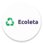
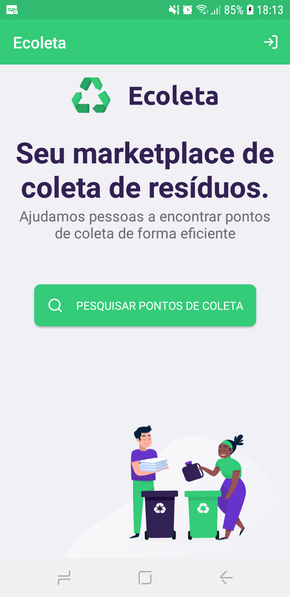
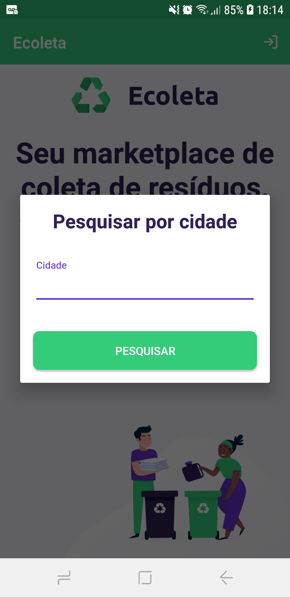
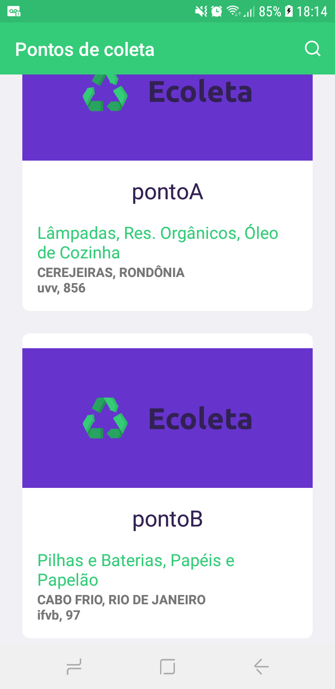
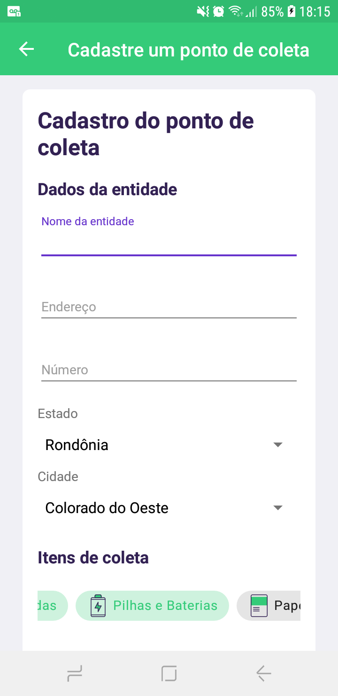

<h1>
Ecoleta

</h1> 

   

# Sobre o projeto
O aplicativo se resume a fazer a conexão entre pontos de coleta de lixo presentes numa cidade e seus moradores. No app é possível achar um ponto de coleta próximo, como também é possível cadastrar uma empresa que trabalha com o serviço de coleta. O projeto foi agregador no sentido de poder fazer conexão com outros programadores através do discord.

## Contruído com
* AlertDialog
* Spinner
* ChipGroup
* SearchBar
* Retrofit
* Firebase

## Instale o app
[ecoleta](https://drive.google.com/file/d/16tN5Tgr5NL6D8V3_pI1cosWb-p8LDw0F/view?usp=sharing)

## Funcionalidades
* para pesquisar um ponto de coleta, aperte no botão na tela inicial e insira o nome da cidade
* para cadastrar um ponto de coleta, aperte no ícone no canto superior direito
* para confirmar o cadastro de um ponto, certifique-se de preencher todos os campos e marcar os itens que fazem parte do serviço

